# dockerbox

Notas sobre la instalación de dockerbox.

## Instalar Docker en Windows 10

Windows 10 Pro:

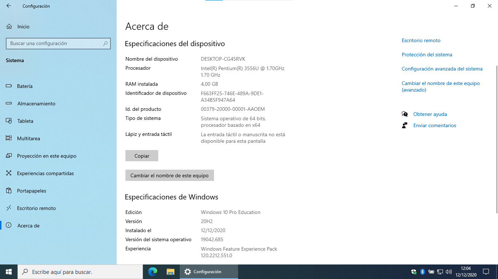

Descargar e instalar:


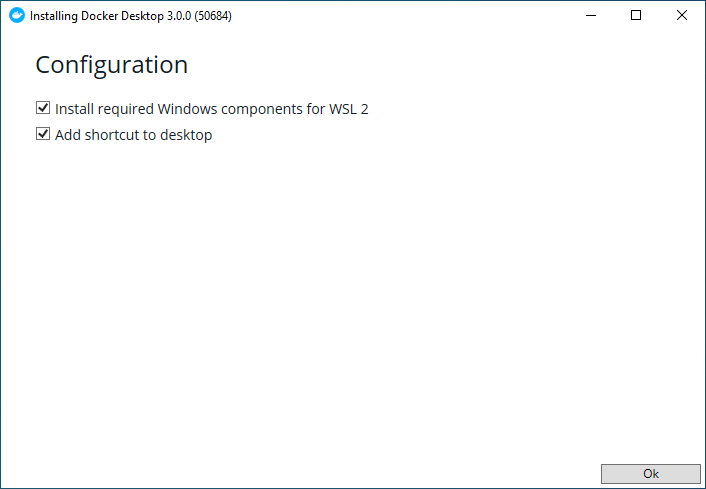

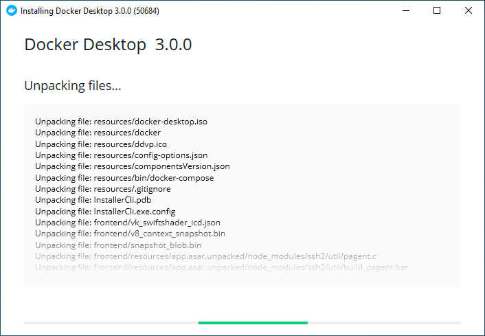

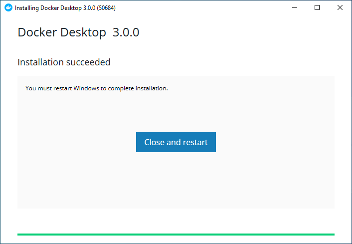

Instalar el paquete WSL:

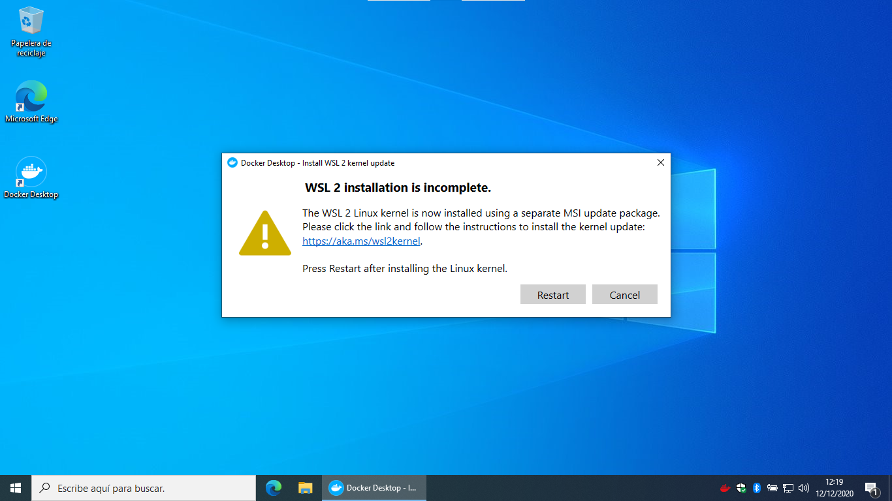

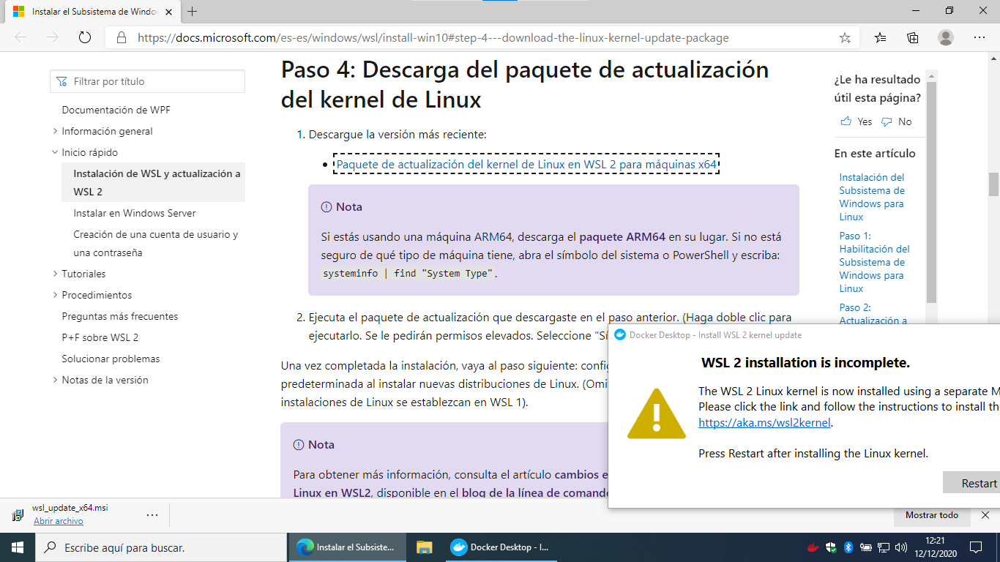

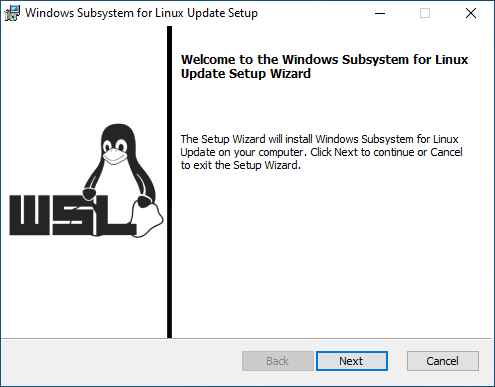

Reiniciar:

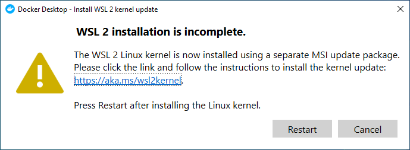

Arranque de Docker:

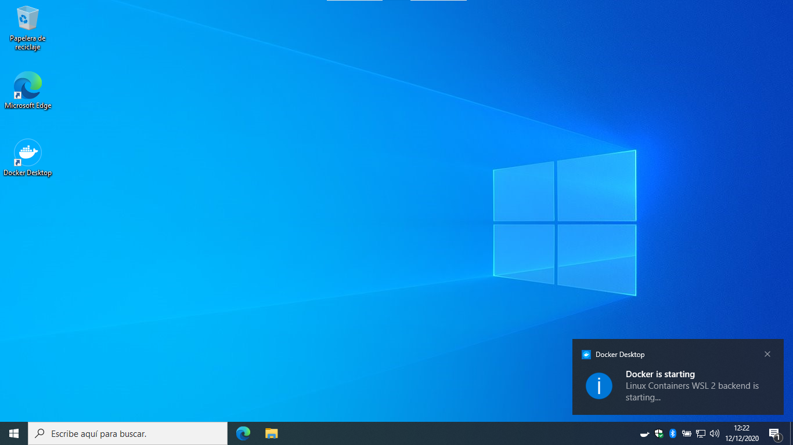

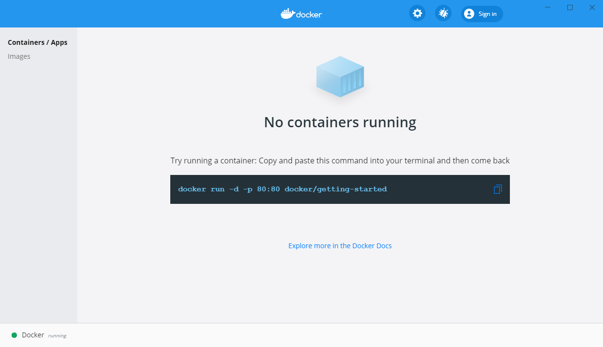

## Instalar make

Chocolatey:

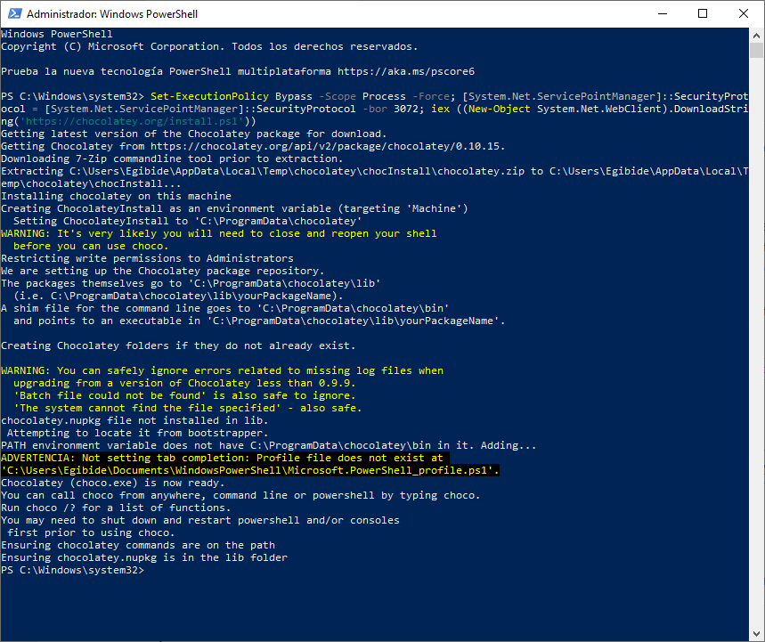

Make:

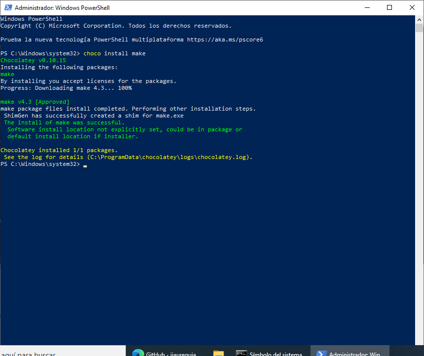

## Error de credential-desktop

Si da este error al arrancar:

```text
docker.errors.DockerException: Credentials store error: StoreError('Credentials store docker-credential-desktop exited with "error getting credentials - err: exit status 1, out: `No se ha encontrado el elemento.`".')
```

Editar el fichero:

```text
C:\Users\<usuario>\.docker\config.json
```

Y comprobar que el valor `credStore` aparece una sola vez:

```json
{"credStore":"desktop","stackOrchestrator":"swarm"}
```

## Arrancar los contenedores de dockerbox

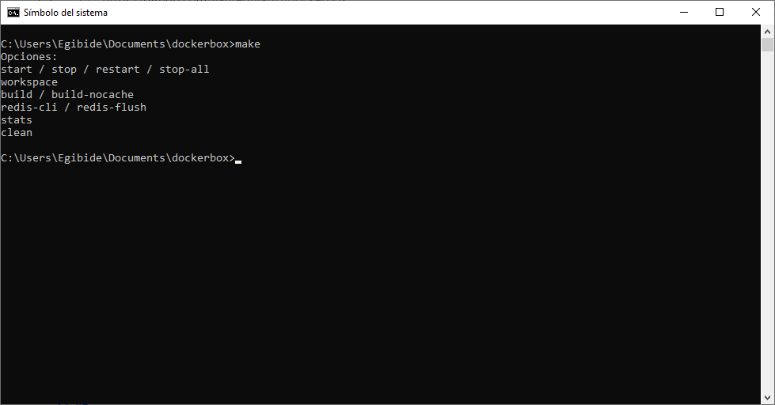

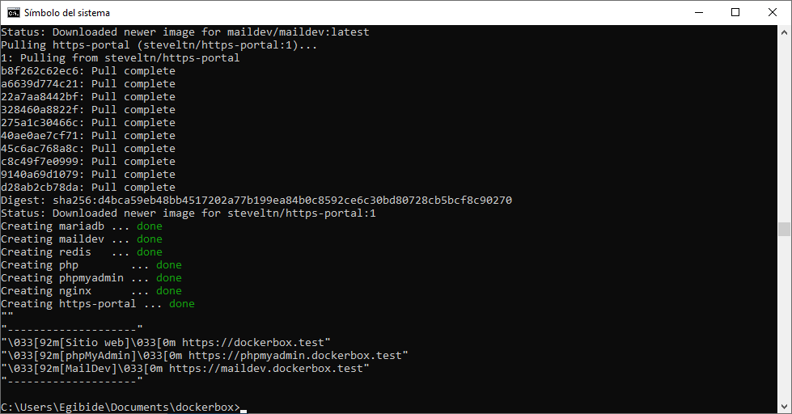

La primera vez hay que esperar a que genere la clave privada:

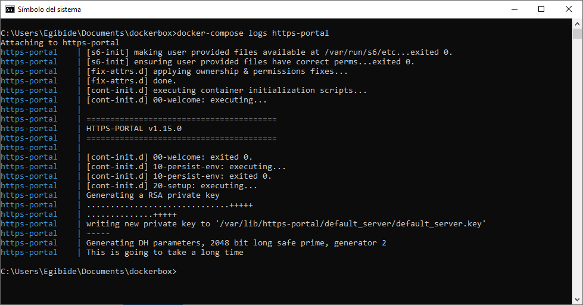

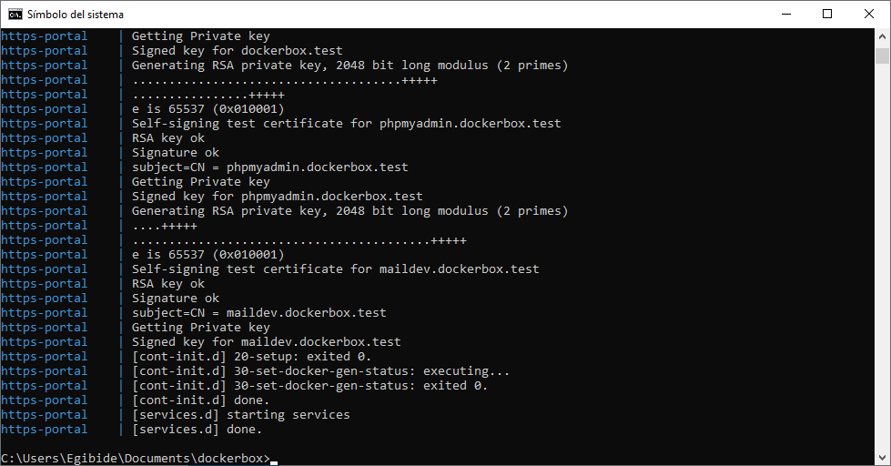

Los certificados son autofirmados:

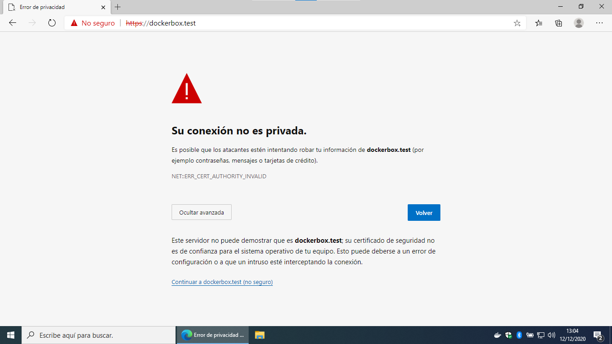

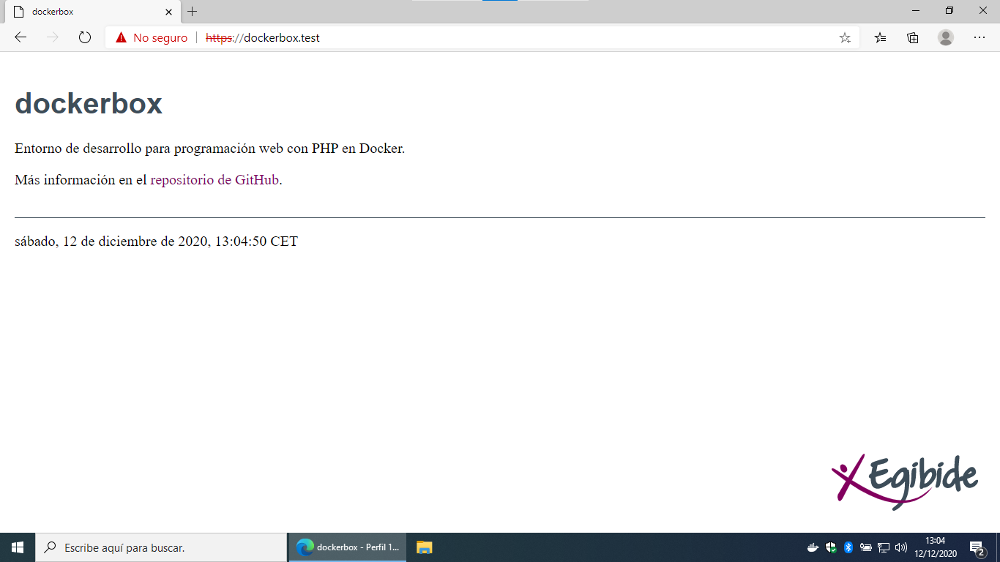

## Reducir el consumo de memoria

[WSL2 Tips: Limit CPU/Memory When using Docker](https://itnext.io/wsl2-tips-limit-cpu-memory-when-using-docker-c022535faf6f)

Crear el fichero:

```text
C:\Users\<usuario>\.wslconfig
```

Y poner en él:

```ini
[wsl2]
memory=1GB
processors=2
```

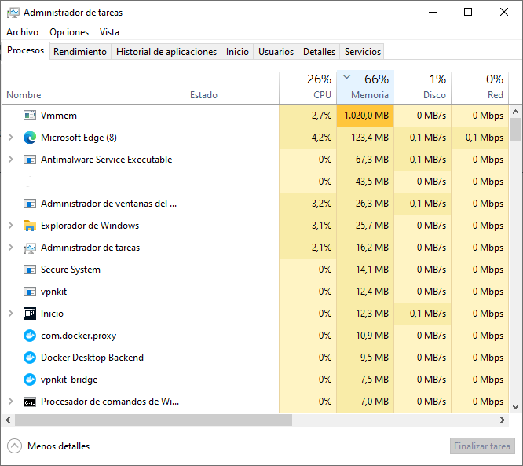

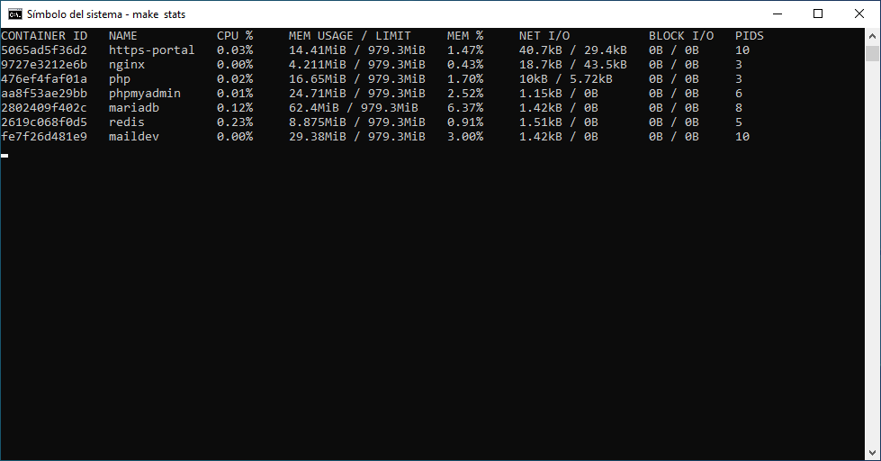
